# Diagramas ER por domínio — GALLO BASE DIESEL

> Mapa de domínios + ER por domínio (mermaid). Gerado de FKs reais (2026-06-17).
> Um único ER de 54 tabelas seria ilegível — o detalhe mora em cada domínio.

## Mapa de domínios

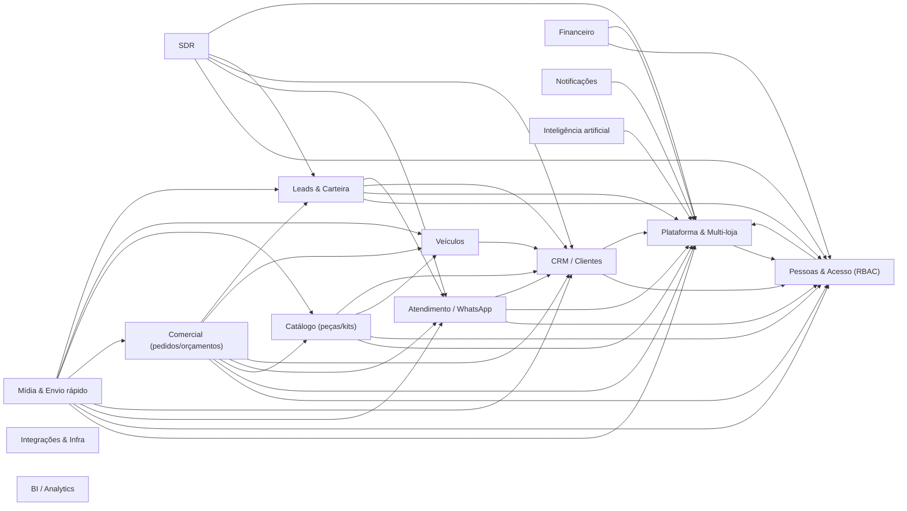

_Seta A → B = alguma tabela do domínio A referencia (FK) uma do domínio B._

## Plataforma & Multi-loja

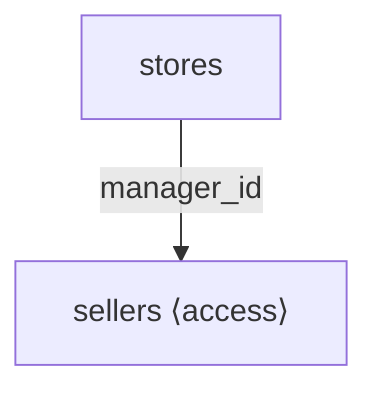

## Pessoas & Acesso (RBAC)

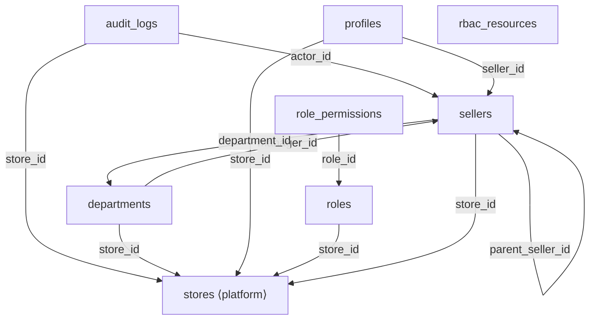

## CRM / Clientes

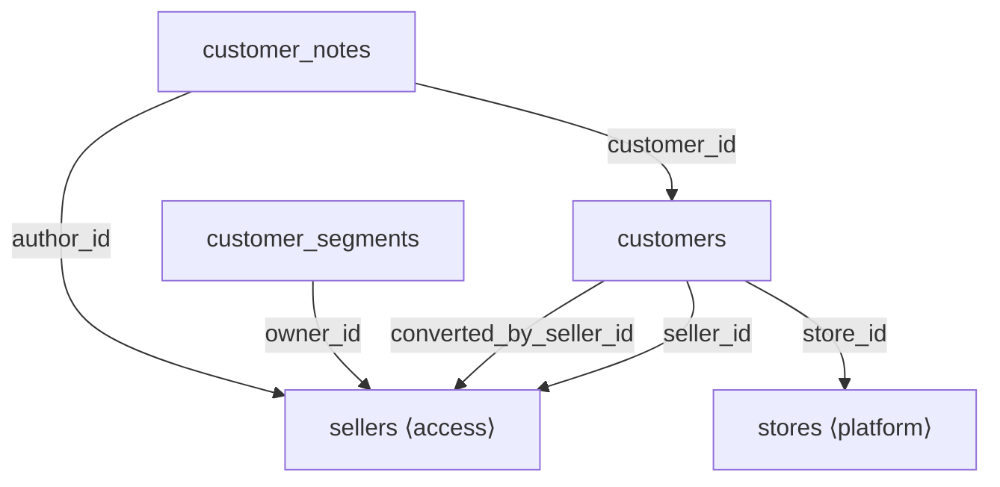

## Veículos

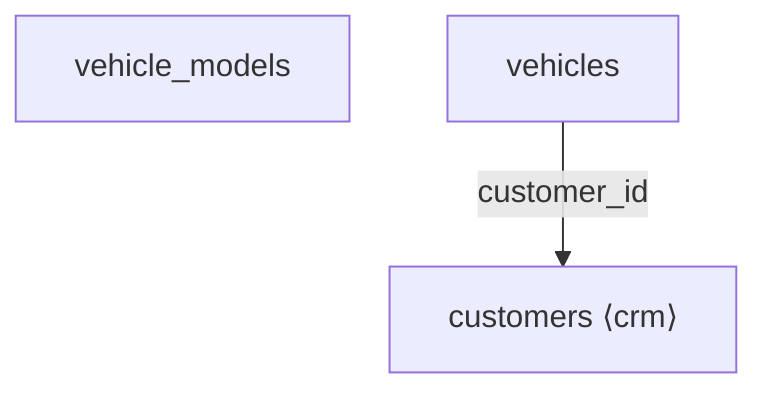

## Leads & Carteira

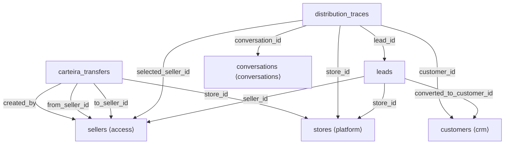

## Atendimento / WhatsApp

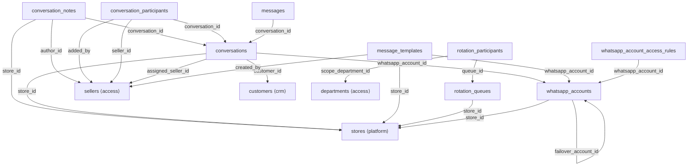

## SDR

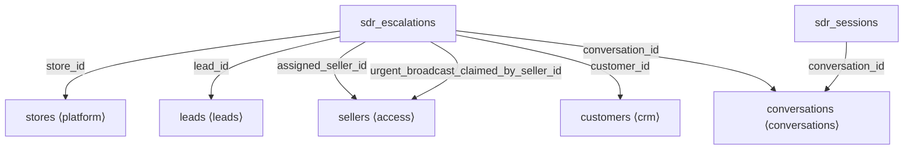

## Comercial (pedidos/orçamentos)

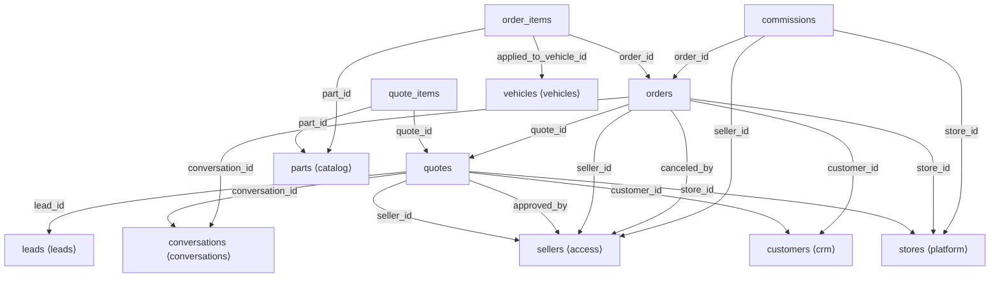

## Catálogo (peças/kits)

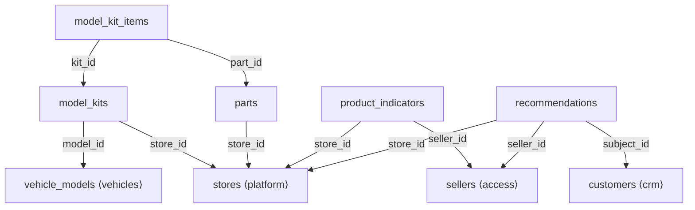

## Mídia & Envio rápido

```mermaid
flowchart TD
  asset_combos["asset_combos"]
  asset_favorites["asset_favorites"]
  asset_library_items["asset_library_items"]
  asset_send_log["asset_send_log"]
  media_assets["media_assets"]
  quick_replies["quick_replies"]
  scheduled_sends["scheduled_sends"]
  trackable_links["trackable_links"]
  sellers["sellers ⟨access⟩"]
  asset_combos -->|owner_id| sellers
  stores["stores ⟨platform⟩"]
  asset_combos -->|store_id| stores
  asset_favorites -->|asset_id| asset_library_items
  sellers["sellers ⟨access⟩"]
  asset_favorites -->|seller_id| sellers
  stores["stores ⟨platform⟩"]
  asset_library_items -->|store_id| stores
  asset_send_log -->|asset_id| asset_library_items
  sellers["sellers ⟨access⟩"]
  asset_send_log -->|seller_id| sellers
  conversations["conversations ⟨conversations⟩"]
  media_assets -->|conversation_id| conversations
  customers["customers ⟨crm⟩"]
  media_assets -->|customer_id| customers
  orders["orders ⟨commercial⟩"]
  media_assets -->|linked_order_id| orders
  parts["parts ⟨catalog⟩"]
  media_assets -->|linked_part_id| parts
  vehicles["vehicles ⟨vehicles⟩"]
  media_assets -->|linked_vehicle_id| vehicles
  messages["messages ⟨conversations⟩"]
  media_assets -->|message_id| messages
  stores["stores ⟨platform⟩"]
  media_assets -->|store_id| stores
  sellers["sellers ⟨access⟩"]
  quick_replies -->|owner_id| sellers
  stores["stores ⟨platform⟩"]
  quick_replies -->|store_id| stores
  conversations["conversations ⟨conversations⟩"]
  scheduled_sends -->|conversation_id| conversations
  stores["stores ⟨platform⟩"]
  scheduled_sends -->|store_id| stores
  conversations["conversations ⟨conversations⟩"]
  trackable_links -->|conversation_id| conversations
  leads["leads ⟨leads⟩"]
  trackable_links -->|lead_id| leads
  stores["stores ⟨platform⟩"]
  trackable_links -->|store_id| stores
```

## Financeiro

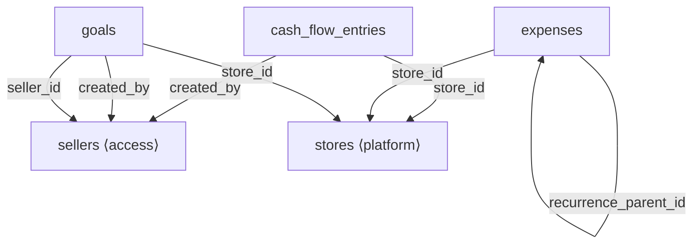

## Notificações

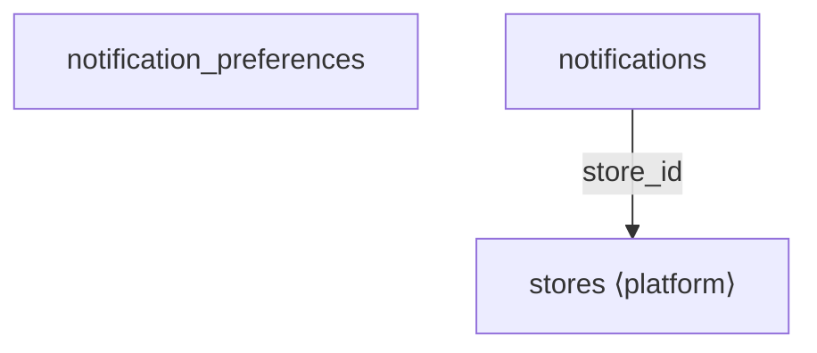

## Inteligência artificial

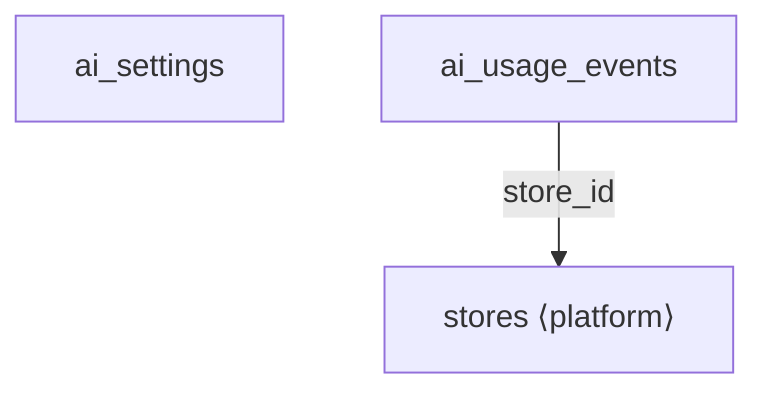

## Integrações & Infra

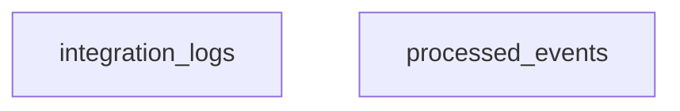
